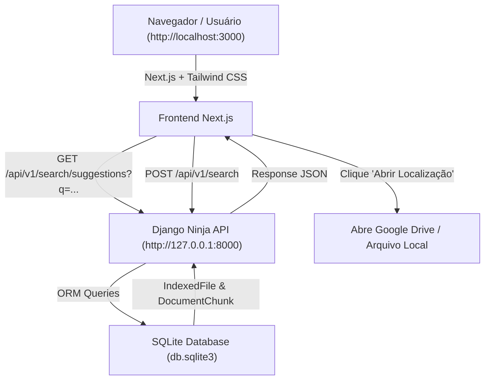

# Design Spec: Frontend Next.js + Melhorias na Busca & Autocomplete

**Data:** 2026-09-29  
**Status:** Aprovado pelo Usuário  
**Projeto:** Buscador de Músicas (`arquivos_missa`)  

---

## 1. Visão Geral e Objetivos

O objetivo deste design é fornecer uma interface web moderna, responsiva e elegante construída com **Next.js 14+ (React)** e **Tailwind CSS**, consumindo a API assíncrona do **Django Ninja**, acompanhada de melhorias no algoritmo de busca determinística e na experiência do usuário ao localizar cantos e apresentações de missas.

### Requisitos Principais:
1. **Interface Next.js + Tailwind CSS:**
   - Paleta de cores temática:
     - Primária: `#E7D6A3` (Creme / Ouro Suave)
     - Secundária: `#F9DF80` (Ouro Quente Vivo)
     - Terciária: `#352723` (Café Profundo / Chocolate Escuro)
     - Detalhes / Bordas: `#B3965E` (Bronze Dourado)
   - Campo de busca com **Autocomplete ao digitar** (menu suspenso com até 4 sugestões roláveis).
   - Botão **"Abrir Localização"**:
     - Se origem = `google_drive`: Abre a URL direta da apresentação/documento no Google Drive no navegador (`https://docs.google.com/presentation/d/{id}` ou link da pasta).
     - Se origem = `local`: Abre a pasta/arquivo no computador local.
   - Lista completa de resultados (sem limitação indevida a 1 único arquivo quando houver múltiplos arquivos válidos).

2. **Backend Django Ninja API:**
   - Executado via `python manage.py runserver 8000`.
   - **Correção da Precisão da Busca:** Exige 100% da correspondência das palavras chaves significativas para buscas curtas/médias (previne que a busca por *"nós vos damos graças"* retorne textos que contêm apenas *"nós"* sem *"graças"*).
   - Super-bônus de pontuação para frase exata (`+100.0`).
   - Endpoint GET `/api/v1/search/suggestions` para retornar até 4 sugestões de títulos/músicas ao digitar.
   - Preservação do `external_id` (Google Drive File ID / URL) para redirecionamento correto no navegador.

---

## 2. Arquitetura do Sistema



---

## 3. Detalhamento dos Componentes

### 3.1 Backend (Django & Django Ninja API)

#### Novos e Atualizados Endpoints em `finder_files/api.py`:
- `GET /api/v1/search/suggestions?q={query}`: Retorna lista com até 4 sugestões baseadas no início ou conteúdo de títulos e trechos marcantes.
- `POST /api/v1/search`: Retorna os resultados ordenados por pontuação com a propriedade `open_url` ou `file_path`.

#### Atualizações no Algoritmo de Busca (`FileSearchService`):
```python
# Para consultas com N termos significativos:
# 1. Requer que TODOS os termos significativos estejam presentes no trecho (ou pelo menos N-1 para consultas com >4 termos)
# 2. Atribui pontuação extra massiva (+100.0) para frase literal exata
# 3. Inclui a URL pública/direta do Google Drive (ex: https://docs.google.com/presentation/d/{external_id})
```

#### Modelo `IndexedFile`:
- Adicionar/garantir campo `external_id` ou propriedade `open_url` que constrói o link do Google Drive quando `source == 'google_drive'`.

---

### 3.2 Frontend (Next.js + Tailwind CSS em `frontend_next/`)

#### Estrutura de Diretórios:
```text
frontend_next/
├── package.json
├── tailwind.config.js
├── next.config.js
├── src/
│   ├── app/
│   │   ├── layout.tsx
│   │   ├── page.tsx
│   │   └── globals.css
│   └── components/
│       ├── Header.tsx
│       ├── SearchBar.tsx
│       ├── AutocompleteDropdown.tsx
│       ├── SearchResultsList.tsx
│       ├── ResultCard.tsx
│       └── FolderIndexerModal.tsx
```

#### Paleta no `tailwind.config.js`:
```javascript
theme: {
  extend: {
    colors: {
      primary: '#E7D6A3',
      secondary: '#F9DF80',
      tertiary: '#352723',
      accent: '#B3965E',
    }
  }
}
```

#### Experiência de Uso (UX):
1. O usuário digita no campo de busca.
2. Após 200ms de debounce, o componente chama `/api/v1/search/suggestions?q=...` e abre o dropdown com até 4 sugestões.
3. Ao pressionar Enter ou clicar em **Pesquisar**, envia a consulta completa para `POST /api/v1/search`.
4. Os cards são renderizados com suporte a modo escuro/claro estilizado em tons `#352723` (fundo) e `#E7D6A3` (destaques).
5. O botão "Abrir Localização" abre a URL no navegador se for arquivo do Google Drive, ou o caminho local se for arquivo do computador.

---

## 4. Plano de Testes e Validação

1. **Testes de Busca Determinística (Pytest):**
   - Testar consulta `"nós vos damos graças"` e confirmar que **NÃO** retorna trechos de hinos que contêm apenas a palavra *"nós"* sem *"graças"*.
   - Testar retorno de múltiplos arquivos quando a música existir em apresentações de anos diferentes (ex: 2017, 2021, 2026).
2. **Testes do Endpoint de Sugestões:**
   - Fazer requisição GET em `/api/v1/search/suggestions?q=Santo` e verificar que até 4 sugestões são retornadas em menos de 50ms.
3. **Validação da Interface Web (Next.js):**
   - Executar `npm run dev` e testar a busca no navegador em `http://localhost:3000`.
   - Verificar se as cores `#E7D6A3`, `#F9DF80`, `#352723` e `#B3965E` estão aplicadas corretamente.
